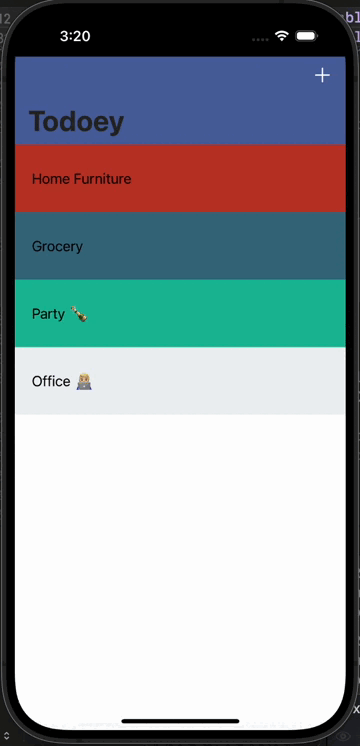

# Todoey ✓

## Goal

Todoey is a versatile task management application built with Swift, offering users the ability to efficiently organize their tasks. It provides two different approaches for data persistence: Core Data and Realm. The app also leverages CocoaPods to integrate swipe cell functionality into its table view, enhancing user interaction. Furthermore, Todoey implements a search bar feature, enabling users to find specific tasks quickly. Key features of the app include:

## Core Data and Realm Integration 
Todoey offers users the choice between two robust data persistence frameworks: Core Data and Realm. Core Data provides seamless integration with the app's data model, while Realm offers a flexible and efficient alternative.

## Swipe Cell Functionality 
Utilizing CocoaPods, Todoey implements swipe cell functionality in its table view. This feature allows users to perform actions such as completing or deleting tasks with simple swipe gestures, enhancing usability.

## Search Bar Functionality 
Todoey includes a search bar feature that enables users to search for specific tasks by typing keywords. As users type, the app dynamically filters the tasks based on the search query, providing instant feedback and simplifying task discovery.
